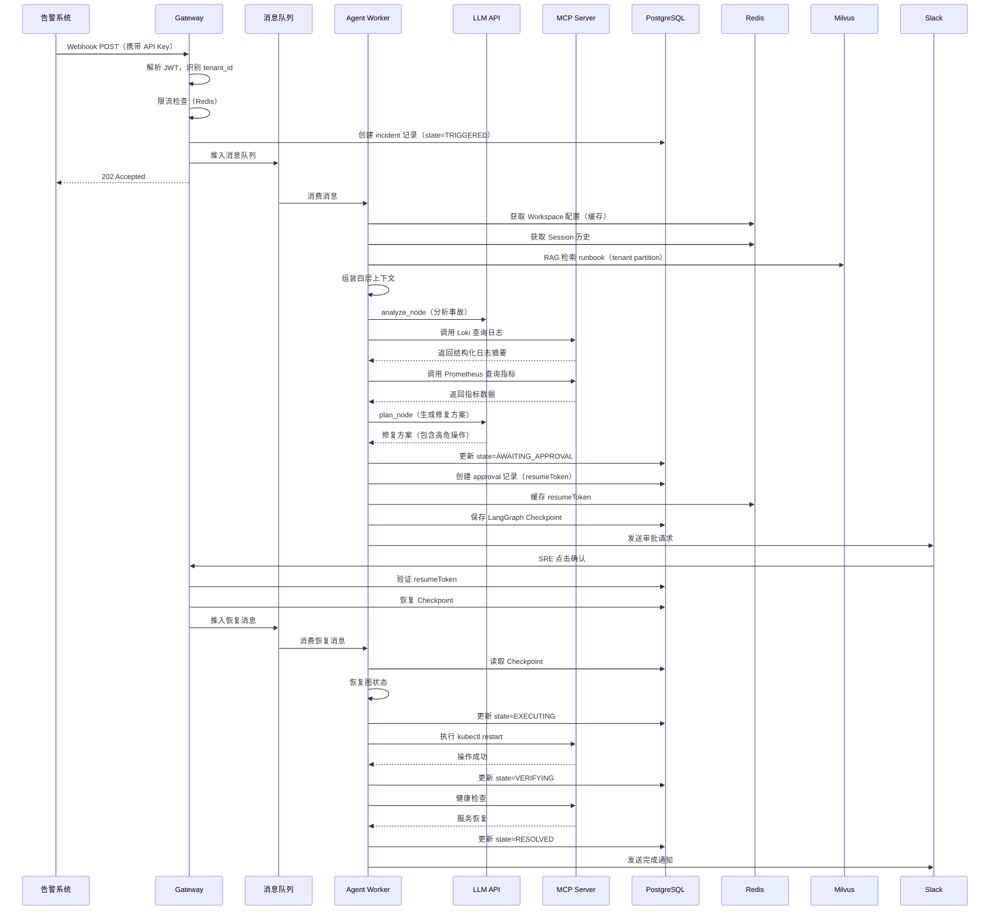

# 设计文档：多租户 OnCall Agent 平台

## 概览

### 系统定位

本系统是一个企业级多租户 OnCall AI Agent 平台，基于 LangGraph + Milvus RAG + MCP 工具集成，参考 OpenClaw 架构思想实现。核心价值链：告警触发 → Agent 自动分析日志和监控 → 检索相关 runbook → 生成修复方案 → SRE 确认 → 执行修复 → 验证恢复。

### 设计目标

1. **多租户隔离**：支持多个企业组织独立使用平台，数据完全隔离
2. **混合部署**：云端控制面 + 用户内网 MCP Server，生产凭证不离开内网
3. **持久化可靠**：Session、Checkpoint、审批记录持久化，服务重启可恢复
4. **成本优化**：通过四层上下文 Compaction 减少 70% token 消耗
5. **可观测性**：LangSmith 追踪 Agent 行为 + Prometheus 监控系统指标
6. **可扩展性**：预留消息队列接口，支持从 BackgroundTasks 平滑迁移到 Kafka

### 技术栈

- **API 框架**：FastAPI + Pydantic（参数验证）
- **ORM**：SQLAlchemy + Alembic（数据库迁移）
- **认证**：PyJWT（JWT 令牌）
- **缓存**：redis-py（Redis 客户端）
- **向量数据库**：pymilvus（Milvus 客户端）
- **状态图引擎**：LangGraph（官方框架）
- **监控**：prometheus-client（指标采集）
- **追踪**：LangSmith（Agent 行为追踪）
- **测试**：pytest + pytest-asyncio + pytest-mock
- **代码质量**：black + isort + mypy + ruff

## 架构

### 部署架构

系统采用混合部署模式，控制面部署在云端，工具执行在用户内网：

```
┌─────────────────────────────────────────┐
│           平台云端（我们部署）            │
│                                         │
│  ┌─────────────────────────────────┐   │
│  │  Gateway 层（无状态）            │   │
│  │  - FastAPI 入口                 │   │
│  │  - JWT 中间件                   │   │
│  │  - 消息路由                     │   │
│  │  - 限流检查                     │   │
│  └─────────────────────────────────┘   │
│                                         │
│  ┌─────────────────────────────────┐   │
│  │  Agent Worker 层                │   │
│  │  - LangGraph 图执行             │   │
│  │  - 上下文 Compaction            │   │
│  │  - RAG 检索                     │   │
│  └─────────────────────────────────┘   │
│                                         │
│  ┌─────────────────────────────────┐   │
│  │  存储层                          │   │
│  │  - PostgreSQL（元数据+RLS）     │   │
│  │  - Redis（热数据+缓存）         │   │
│  │  - Milvus（向量检索+Partition） │   │
│  │  - S3（归档+大文件）            │   │
│  └─────────────────────────────────┘   │
│                                         │
│  ┌─────────────────────────────────┐   │
│  │  可观测性                        │   │
│  │  - LangSmith（Agent 追踪）      │   │
│  │  - Prometheus + Grafana         │   │
│  └─────────────────────────────────┘   │
└──────────────┬──────────────────────────┘
               │ MCP 协议（HTTPS）
               │
┌──────────────▼──────────────────────────┐
│           用户内网（用户部署）            │
│                                         │
│  ┌─────────────────────────────────┐   │
│  │  MCP Server                     │   │
│  │  - Prometheus 查询              │   │
│  │  - Loki 日志查询                │   │
│  │  - kubectl 操作                 │   │
│  │  - 数据库查询                   │   │
│  └─────────────────────────────────┘   │
│                                         │
│  生产环境（K8s、数据库、监控系统）       │
└─────────────────────────────────────────┘
```

### 数据流架构

一次完整的事故处理流程：



### 模块架构

系统分为以下核心模块：

```
gateway/                    # Gateway 层
├── server.py              # FastAPI 应用入口
├── middleware.py          # JWT 解析 + tenant 上下文注入
├── router.py              # 消息路由（Webhook/Slack → Agent）
└── limiter.py             # 限流检查

agents/                     # Agent 层
├── supervisor.py          # 路由判断（Chat vs AIOps）
├── chat_agent.py          # ReAct Chat Agent（只读工具）
├── aiops_agent.py         # 6 状态 AIOps StateGraph
└── context.py             # 上下文组装

memory/                     # 记忆层
├── session_store.py       # Session 三层存储
├── vector_store.py        # Milvus 多租户隔离
├── compaction.py          # 四层上下文 Compaction
└── checkpoint.py          # LangGraph Checkpoint 管理

workflow/                   # 工作流引擎
├── engine.py              # YAML pipeline 执行
├── approval.py            # resumeToken 审批门
└── runbooks/              # 预置 YAML 模板

tools/                      # 工具集成
└── mcp_client.py          # MCP 协议客户端

auth/                       # 认证授权
├── jwt.py                 # JWT 编解码
└── rbac.py                # 基于角色的访问控制

storage/                    # 存储层
├── models.py              # SQLAlchemy 数据模型
├── database.py            # 数据库连接池
└── migrations/            # Alembic 迁移脚本

observability/              # 可观测性
├── langsmith.py           # LangSmith 集成
└── metrics.py             # Prometheus 指标

api/                        # REST API
├── incidents.py           # 事故管理 API
├── approvals.py           # 审批 API
├── workspaces.py          # Workspace 配置 API
└── webhooks.py            # Webhook 接入 API

evaluation/                 # 评估与测试
├── ragas_eval.py          # RAGAS 评估
├── token_benchmark.py     # Token A/B 测试
└── mock_incidents.py      # 模拟事故数据
```

## 组件和接口

### Gateway 层

#### 职责

- 接收来自 Webhook、Slack 的消息
- 解析 JWT，识别 tenant_id 和 user_id
- 归一化不同来源的消息格式
- 限流检查（per-tenant 配额）
- 推入消息队列（当前：BackgroundTasks，未来：Kafka）

#### 接口

**消息归一化接口**

```python
from pydantic import BaseModel
from typing import Literal

class MessageEnvelope(BaseModel):
    """统一消息格式"""
    tenant_id: str
    user_id: str
    agent_id: str
    sender: str  # 发送者标识
    content: str  # 消息内容
    channel: Literal["webhook", "slack", "api"]
    thread_id: str | None  # Slack thread 或 session key
    metadata: dict  # 额外元数据（告警级别、来源系统等）
```

**限流接口**

```python
from abc import ABC, abstractmethod

class RateLimiter(ABC):
    @abstractmethod
    async def check_limit(self, tenant_id: str) -> bool:
        """检查租户是否超过配额"""
        pass

class RedisRateLimiter(RateLimiter):
    async def check_limit(self, tenant_id: str) -> bool:
        key = f"quota:tenant:{tenant_id}:requests:{current_minute}"
        count = await redis.incr(key)
        await redis.expire(key, 60)
        return count <= tenant_quota
```

**消息队列接口**

```python
from abc import ABC, abstractmethod

class MessageQueue(ABC):
    @abstractmethod
    async def enqueue(self, message: MessageEnvelope) -> None:
        """推入消息"""
        pass
    
    @abstractmethod
    async def dequeue(self) -> MessageEnvelope:
        """消费消息"""
        pass

class BackgroundTasksQueue(MessageQueue):
    """当前实现：FastAPI BackgroundTasks"""
    async def enqueue(self, message: MessageEnvelope) -> None:
        background_tasks.add_task(process_message, message)

class KafkaQueue(MessageQueue):
    """未来实现：Kafka"""
    async def enqueue(self, message: MessageEnvelope) -> None:
        await producer.send("oncall-messages", message.json())
```

### Agent Worker 层

#### 职责

- 消费消息队列
- 组装四层上下文（Workspace + Summary + Recent + RAG）
- 执行 LangGraph 状态图
- 触发 Compaction（上下文超限时）
- 处理 interrupt() 审批流程

#### 接口

**上下文组装接口**

```python
from pydantic import BaseModel

class ContextLayers(BaseModel):
    """四层上下文结构"""
    layer1_permanent: str  # Workspace 配置（soul/agents_md/user_md）
    layer2_summary: str  # branch_summary（历史摘要）
    layer3_recent: list[dict]  # 最近 3-5 轮完整消息
    layer4_rag: list[str]  # RAG 检索的 runbook chunks

class ContextAssembler:
    async def assemble(
        self, 
        tenant_id: str, 
        agent_id: str, 
        session_key: str,
        query: str
    ) -> ContextLayers:
        """组装四层上下文"""
        # Layer 1: 从 Redis 缓存或 PostgreSQL 读取 Workspace
        workspace = await self.get_workspace(tenant_id, agent_id)
        
        # Layer 2: 从 Redis 读取 branch_summary
        summary = await redis.get(f"session:{session_key}:summary")
        
        # Layer 3: 从 Redis 读取最近消息
        recent = await redis.lrange(f"session:{session_key}:messages", -5, -1)
        
        # Layer 4: 从 Milvus 检索 runbook
        rag_results = await milvus.search(
            collection_name="runbooks",
            partition_names=[f"tenant_{tenant_id}"],
            data=[embedding],
            filter=f"tenant_id == '{tenant_id}'"
        )
        
        return ContextLayers(...)
```

**Compaction 接口**

```python
class Compaction:
    async def should_compact(self, context: ContextLayers) -> bool:
        """判断是否需要压缩"""
        total_tokens = self.count_tokens(context)
        return total_tokens > (context_window - 20000)
    
    async def compact(self, session_key: str, messages: list[dict]) -> str:
        """执行压缩，返回 branch_summary"""
        # 使用 LLM 提炼关键信息
        summary = await llm.invoke(
            "提炼以下对话的关键信息（告警原文、诊断结论、已执行操作）：\n" + 
            "\n".join([m["content"] for m in messages])
        )
        
        # 存入 Redis
        await redis.set(f"session:{session_key}:summary", summary)
        
        # 保留最近 3-5 轮，丢弃更早的
        await redis.ltrim(f"session:{session_key}:messages", -5, -1)
        
        # 更新压缩计数
        await redis.incr(f"session:{session_key}:compaction_count")
        
        return summary
```

### Memory 层

#### Session 三层存储

**存储策略**

| 存储 | 存什么 | TTL/保留策略 |
|------|--------|-------------|
| Redis | 热 Session 消息列表（最近对话） | 24 小时未活跃则归档 |
| PostgreSQL | Session 元数据（session_key、token_count、last_active） | 永久保留 |
| S3 | 对话 JSONL 归档（冷数据） | 按租户配置保留期限 |

**接口**

```python
from abc import ABC, abstractmethod

class SessionStore(ABC):
    @abstractmethod
    async def get_messages(self, session_key: str) -> list[dict]:
        """获取 Session 消息"""
        pass
    
    @abstractmethod
    async def append_message(self, session_key: str, message: dict) -> None:
        """追加消息"""
        pass
    
    @abstractmethod
    async def archive_session(self, session_key: str) -> None:
        """归档到 S3"""
        pass

class RedisSessionStore(SessionStore):
    async def get_messages(self, session_key: str) -> list[dict]:
        messages = await redis.lrange(f"session:{session_key}:messages", 0, -1)
        return [json.loads(m) for m in messages]
    
    async def append_message(self, session_key: str, message: dict) -> None:
        await redis.rpush(f"session:{session_key}:messages", json.dumps(message))
        await redis.expire(f"session:{session_key}:messages", 86400)  # 24h
    
    async def archive_session(self, session_key: str) -> None:
        messages = await self.get_messages(session_key)
        jsonl = "\n".join([json.dumps(m) for m in messages])
        await s3.put_object(
            Bucket="oncall-sessions",
            Key=f"{session_key}.jsonl",
            Body=jsonl
        )
        await redis.delete(f"session:{session_key}:messages")
```

#### Milvus 多租户隔离

**隔离策略**

- 每个租户一个 Partition（`tenant_{tenant_id}`）
- 查询时同时指定 `partition_names` 和 `filter`（双重防护）
- 返回结果后验证 tenant_id 一致性

**接口**

```python
class VectorStore:
    async def ingest_runbook(
        self, 
        tenant_id: str, 
        document: str, 
        metadata: dict
    ) -> None:
        """摄入 runbook"""
        # 切片
        chunks = self.split_document(document)
        
        # 生成 embedding
        embeddings = await self.embed(chunks)
        
        # 写入 Milvus（指定 partition）
        await milvus.insert(
            collection_name="runbooks",
            partition_name=f"tenant_{tenant_id}",
            data=[
                {
                    "embedding": emb,
                    "text": chunk,
                    "tenant_id": tenant_id,
                    **metadata
                }
                for emb, chunk in zip(embeddings, chunks)
            ]
        )
    
    async def search(
        self, 
        tenant_id: str, 
        query: str, 
        top_k: int = 5
    ) -> list[dict]:
        """检索 runbook"""
        query_embedding = await self.embed([query])
        
        # 指定 partition 和 filter（双重防护）
        results = await milvus.search(
            collection_name="runbooks",
            partition_names=[f"tenant_{tenant_id}"],
            data=query_embedding,
            filter=f"tenant_id == '{tenant_id}'",
            limit=top_k
        )
        
        # 验证结果的 tenant_id
        for result in results:
            assert result["tenant_id"] == tenant_id, "Tenant isolation violated!"
        
        return results
```

### Workflow 引擎

#### YAML 格式

```yaml
name: service_restart
description: 重启服务并验证恢复
steps:
  - name: fetch_logs
    type: mcp_call
    tool: loki_query
    params:
      query: '{service="{{service_name}}"} |= "error"'
      time_range: 30m
  
  - name: analyze
    type: llm_call
    prompt: |
      分析以下日志，判断是否需要重启服务：
      {{steps.fetch_logs.output}}
  
  - name: confirm_restart
    type: approval
    message: "建议重启 {{service_name}}，原因：{{steps.analyze.output}}"
  
  - name: kubectl_restart
    type: mcp_call
    tool: kubectl
    params:
      action: restart
      deployment: "{{service_name}}"
  
  - name: health_check
    type: mcp_call
    tool: health_check
    params:
      service: "{{service_name}}"
      wait_seconds: 60
```

#### 接口

```python
from pydantic import BaseModel

class WorkflowStep(BaseModel):
    name: str
    type: Literal["mcp_call", "llm_call", "approval"]
    tool: str | None
    params: dict | None
    prompt: str | None
    message: str | None

class Workflow(BaseModel):
    name: str
    description: str
    steps: list[WorkflowStep]

class WorkflowEngine:
    async def execute(
        self, 
        workflow: Workflow, 
        context: dict,
        resume_token: str | None = None
    ) -> dict:
        """执行 workflow"""
        # 如果有 resume_token，从断点恢复
        if resume_token:
            completed_steps = await self.get_completed_steps(resume_token)
            start_index = len(completed_steps)
        else:
            completed_steps = {}
            start_index = 0
        
        results = completed_steps.copy()
        
        for i, step in enumerate(workflow.steps[start_index:], start=start_index):
            if step.type == "approval":
                # 生成 resumeToken 并暂停
                token = str(uuid.uuid4())
                await self.save_approval(token, workflow, results)
                raise ApprovalRequired(token, step.message)
            
            elif step.type == "mcp_call":
                result = await mcp_client.call(step.tool, step.params)
                results[step.name] = result
            
            elif step.type == "llm_call":
                result = await llm.invoke(step.prompt.format(**context, steps=results))
                results[step.name] = result
        
        return results
```

## 数据模型

### PostgreSQL 核心表

#### tenants 表

```sql
CREATE TABLE tenants (
    id UUID PRIMARY KEY DEFAULT gen_random_uuid(),
    name VARCHAR(255) NOT NULL,
    plan VARCHAR(50) NOT NULL,  -- Free/Pro/Enterprise
    api_key VARCHAR(255) UNIQUE NOT NULL,
    quota_requests_per_minute INTEGER NOT NULL DEFAULT 60,
    quota_tokens_per_month BIGINT NOT NULL DEFAULT 1000000,
    created_at TIMESTAMP NOT NULL DEFAULT NOW(),
    updated_at TIMESTAMP NOT NULL DEFAULT NOW()
);

CREATE INDEX idx_tenants_api_key ON tenants(api_key);
```

#### users 表

```sql
CREATE TABLE users (
    id UUID PRIMARY KEY DEFAULT gen_random_uuid(),
    tenant_id UUID NOT NULL REFERENCES tenants(id) ON DELETE CASCADE,
    email VARCHAR(255) NOT NULL,
    hashed_password VARCHAR(255) NOT NULL,
    role VARCHAR(50) NOT NULL,  -- Admin/Member/Viewer
    created_at TIMESTAMP NOT NULL DEFAULT NOW(),
    UNIQUE(tenant_id, email)
);

CREATE INDEX idx_users_tenant_id ON users(tenant_id);

-- 启用 RLS
ALTER TABLE users ENABLE ROW LEVEL SECURITY;

CREATE POLICY tenant_isolation ON users
    USING (tenant_id = current_setting('app.tenant_id')::uuid);
```

#### agents 表

```sql
CREATE TABLE agents (
    id UUID PRIMARY KEY DEFAULT gen_random_uuid(),
    tenant_id UUID NOT NULL REFERENCES tenants(id) ON DELETE CASCADE,
    name VARCHAR(255) NOT NULL,
    config JSONB NOT NULL,  -- {soul, agents_md, user_md, tools}
    created_at TIMESTAMP NOT NULL DEFAULT NOW(),
    updated_at TIMESTAMP NOT NULL DEFAULT NOW()
);

CREATE INDEX idx_agents_tenant_id ON agents(tenant_id);

ALTER TABLE agents ENABLE ROW LEVEL SECURITY;

CREATE POLICY tenant_isolation ON agents
    USING (tenant_id = current_setting('app.tenant_id')::uuid);
```

#### sessions 表

```sql
CREATE TABLE sessions (
    id UUID PRIMARY KEY DEFAULT gen_random_uuid(),
    tenant_id UUID NOT NULL REFERENCES tenants(id) ON DELETE CASCADE,
    agent_id UUID NOT NULL REFERENCES agents(id) ON DELETE CASCADE,
    user_id UUID NOT NULL REFERENCES users(id) ON DELETE CASCADE,
    session_key VARCHAR(255) UNIQUE NOT NULL,
    token_count BIGINT NOT NULL DEFAULT 0,
    last_active TIMESTAMP NOT NULL DEFAULT NOW(),
    created_at TIMESTAMP NOT NULL DEFAULT NOW()
);

CREATE INDEX idx_sessions_tenant_id ON sessions(tenant_id);
CREATE INDEX idx_sessions_session_key ON sessions(session_key);
CREATE INDEX idx_sessions_last_active ON sessions(last_active);

ALTER TABLE sessions ENABLE ROW LEVEL SECURITY;

CREATE POLICY tenant_isolation ON sessions
    USING (tenant_id = current_setting('app.tenant_id')::uuid);
```

#### incidents 表

```sql
CREATE TABLE incidents (
    id UUID PRIMARY KEY DEFAULT gen_random_uuid(),
    tenant_id UUID NOT NULL REFERENCES tenants(id) ON DELETE CASCADE,
    session_id UUID NOT NULL REFERENCES sessions(id) ON DELETE CASCADE,
    state VARCHAR(50) NOT NULL,  -- triggered/analyzing/awaiting_approval/executing/verifying/resolved/escalated
    severity VARCHAR(50) NOT NULL,  -- P0/P1/P2/P3
    metadata JSONB NOT NULL,  -- 告警详情、来源系统等
    created_at TIMESTAMP NOT NULL DEFAULT NOW(),
    resolved_at TIMESTAMP
);

CREATE INDEX idx_incidents_tenant_id ON incidents(tenant_id);
CREATE INDEX idx_incidents_state ON incidents(state);
CREATE INDEX idx_incidents_created_at ON incidents(created_at);

ALTER TABLE incidents ENABLE ROW LEVEL SECURITY;

CREATE POLICY tenant_isolation ON incidents
    USING (tenant_id = current_setting('app.tenant_id')::uuid);
```

#### approvals 表

```sql
CREATE TABLE approvals (
    id UUID PRIMARY KEY DEFAULT gen_random_uuid(),
    tenant_id UUID NOT NULL REFERENCES tenants(id) ON DELETE CASCADE,
    incident_id UUID NOT NULL REFERENCES incidents(id) ON DELETE CASCADE,
    resume_token UUID UNIQUE NOT NULL,
    action VARCHAR(255) NOT NULL,  -- 操作描述
    action_payload JSONB NOT NULL,  -- 操作参数
    completed_steps JSONB NOT NULL,  -- 已完成步骤结果
    status VARCHAR(50) NOT NULL,  -- pending/approved/rejected/expired
    requested_by UUID NOT NULL REFERENCES users(id),
    approved_by UUID REFERENCES users(id),
    created_at TIMESTAMP NOT NULL DEFAULT NOW(),
    approved_at TIMESTAMP
);

CREATE INDEX idx_approvals_tenant_id ON approvals(tenant_id);
CREATE INDEX idx_approvals_resume_token ON approvals(resume_token);
CREATE INDEX idx_approvals_status ON approvals(status);

ALTER TABLE approvals ENABLE ROW LEVEL SECURITY;

CREATE POLICY tenant_isolation ON approvals
    USING (tenant_id = current_setting('app.tenant_id')::uuid);
```

#### token_usage 表

```sql
CREATE TABLE token_usage (
    id UUID PRIMARY KEY DEFAULT gen_random_uuid(),
    tenant_id UUID NOT NULL REFERENCES tenants(id) ON DELETE CASCADE,
    agent_id UUID NOT NULL REFERENCES agents(id) ON DELETE CASCADE,
    session_id UUID NOT NULL REFERENCES sessions(id) ON DELETE CASCADE,
    model VARCHAR(100) NOT NULL,
    input_tokens INTEGER NOT NULL,
    output_tokens INTEGER NOT NULL,
    created_at TIMESTAMP NOT NULL DEFAULT NOW()
);

CREATE INDEX idx_token_usage_tenant_id ON token_usage(tenant_id);
CREATE INDEX idx_token_usage_created_at ON token_usage(created_at);

ALTER TABLE token_usage ENABLE ROW LEVEL SECURITY;

CREATE POLICY tenant_isolation ON token_usage
    USING (tenant_id = current_setting('app.tenant_id')::uuid);
```

#### audit_logs 表

```sql
CREATE TABLE audit_logs (
    id UUID PRIMARY KEY DEFAULT gen_random_uuid(),
    tenant_id UUID NOT NULL REFERENCES tenants(id) ON DELETE CASCADE,
    user_id UUID REFERENCES users(id),
    action VARCHAR(255) NOT NULL,
    resource VARCHAR(255) NOT NULL,
    payload JSONB NOT NULL,
    created_at TIMESTAMP NOT NULL DEFAULT NOW()
);

CREATE INDEX idx_audit_logs_tenant_id ON audit_logs(tenant_id);
CREATE INDEX idx_audit_logs_created_at ON audit_logs(created_at);

ALTER TABLE audit_logs ENABLE ROW LEVEL SECURITY;

CREATE POLICY tenant_isolation ON audit_logs
    USING (tenant_id = current_setting('app.tenant_id')::uuid);
```

#### checkpoints 表（LangGraph）

```sql
CREATE TABLE checkpoints (
    id UUID PRIMARY KEY DEFAULT gen_random_uuid(),
    tenant_id UUID NOT NULL REFERENCES tenants(id) ON DELETE CASCADE,
    incident_id UUID NOT NULL REFERENCES incidents(id) ON DELETE CASCADE,
    checkpoint_data JSONB NOT NULL,  -- LangGraph 图状态
    created_at TIMESTAMP NOT NULL DEFAULT NOW()
);

CREATE INDEX idx_checkpoints_tenant_id ON checkpoints(tenant_id);
CREATE INDEX idx_checkpoints_incident_id ON checkpoints(incident_id);

ALTER TABLE checkpoints ENABLE ROW LEVEL SECURITY;

CREATE POLICY tenant_isolation ON checkpoints
    USING (tenant_id = current_setting('app.tenant_id')::uuid);
```

### Redis Key 命名规范

```
# Session 消息列表
session:tenant:{tenant_id}:agent:{agent_id}:{channel}:{user_id}:messages

# Session 摘要
session:{session_key}:summary

# Session 压缩计数
session:{session_key}:compaction_count

# Workspace 配置缓存
workspace:{tenant_id}:{agent_id}

# 限流计数器
quota:tenant:{tenant_id}:requests:{minute}

# ResumeToken 缓存
approval:{resume_token}
```

### Milvus Collection Schema

```python
from pymilvus import CollectionSchema, FieldSchema, DataType

# runbooks Collection
fields = [
    FieldSchema(name="id", dtype=DataType.INT64, is_primary=True, auto_id=True),
    FieldSchema(name="tenant_id", dtype=DataType.VARCHAR, max_length=36),
    FieldSchema(name="embedding", dtype=DataType.FLOAT_VECTOR, dim=1536),
    FieldSchema(name="text", dtype=DataType.VARCHAR, max_length=8192),
    FieldSchema(name="document_id", dtype=DataType.VARCHAR, max_length=36),
    FieldSchema(name="chunk_index", dtype=DataType.INT64),
    FieldSchema(name="metadata", dtype=DataType.JSON),
]

schema = CollectionSchema(fields, description="Runbook embeddings")

# 创建索引
index_params = {
    "metric_type": "COSINE",
    "index_type": "IVF_FLAT",
    "params": {"nlist": 1024}
}

# 为每个租户创建 Partition
collection.create_partition(f"tenant_{tenant_id}")
```

### S3 存储结构

```
oncall-sessions/
├── {tenant_id}/
│   ├── {session_key}.jsonl          # 对话归档
│   └── ...

oncall-runbooks/
├── {tenant_id}/
│   ├── {document_id}.md             # Runbook 原文
│   └── ...
```

## Correctness Properties

*A property is a characteristic or behavior that should hold true across all valid executions of a system-essentially, a formal statement about what the system should do. Properties serve as the bridge between human-readable specifications and machine-verifiable correctness guarantees.*

基于验收标准分析，我们识别出以下核心正确性属性。这些属性将通过 property-based testing 验证，确保系统在各种输入下的正确行为。

### Property Reflection

在编写属性前，我们进行了冗余分析：

- **JWT 编解码和上下文注入**：1.3 和 1.4 可以合并为一个 JWT round-trip 属性
- **数据隔离验证**：2.2、2.4、2.6 都是验证租户隔离，可以合并为统一的隔离属性
- **Session 存储**：4.1、4.2、4.3 是不同存储层的相同行为，可以合并为 Session 持久化属性
- **Compaction 触发和执行**：5.2、5.3、5.4、5.5 是 Compaction 流程的不同步骤，可以合并
- **状态转换记录**：6.3 和 17.1 都是审计记录，可以统一为审计属性
- **Round-trip 属性**：20.3 和 20.5 是相同模式，可以合并为通用 serialization round-trip

### Property 1: JWT Round-Trip 保持身份信息

*For any* 有效的 tenant_id 和 user_id，当编码为 JWT 令牌后再解码，应该得到相同的身份信息，且请求上下文中应正确注入这些信息。

**Validates: Requirements 1.3, 1.4**

### Property 2: 租户数据完全隔离

*For any* 租户 A 和租户 B，当租户 A 查询数据时（PostgreSQL、Milvus、Redis），返回的结果中不应包含任何属于租户 B 的数据。

**Validates: Requirements 2.2, 2.4, 2.6**

### Property 3: Partition 命名一致性

*For any* 租户，在 Milvus 中创建的 Partition 名称应遵循 `tenant_{tenant_id}` 格式，且检索时应指定正确的 partition_names。

**Validates: Requirements 2.3, 2.4**

### Property 4: Redis Key 租户前缀

*For any* Redis 操作，生成的 key 应包含 tenant_id 前缀，格式为 `{resource}:tenant:{tenant_id}:...`。

**Validates: Requirements 2.5**

### Property 5: Session 三层存储一致性

*For any* Session，当消息写入 Redis 时，元数据应同步写入 PostgreSQL，且归档到 S3 后应能完整恢复。

**Validates: Requirements 4.1, 4.2, 4.3, 4.5**

### Property 6: Session 归档触发条件

*For any* Session，当 last_active 时间超过 24 小时时，应触发归档流程，将消息从 Redis 移动到 S3。

**Validates: Requirements 4.4**

### Property 7: 四层上下文结构完整性

*For any* Agent 调用，组装的上下文应包含四层：永久层（Workspace）、摘要层（branch_summary）、近期层（最近消息）、RAG 层（检索结果）。

**Validates: Requirements 5.1**

### Property 8: Compaction 触发和执行

*For any* 上下文，当 token 数超过 (context_window - 20000) 时，应触发 Compaction，生成 branch_summary 存入 Redis，保留最近 3-5 轮消息，丢弃更早消息。

**Validates: Requirements 5.2, 5.3, 5.4, 5.5**

### Property 9: RAG 检索不缓存

*For any* Agent 调用，RAG 检索应重新执行，不使用缓存的检索结果。

**Validates: Requirements 5.6**

### Property 10: 六状态流转完整性

*For any* 事故，状态应按照 TRIGGERED → ANALYZING → AWAITING_APPROVAL → EXECUTING → VERIFYING → RESOLVED 顺序流转，或在失败时转换为 ESCALATED。

**Validates: Requirements 6.1, 6.2**

### Property 11: 状态转换审计记录

*For any* 状态转换，应在 PostgreSQL incidents 表记录转换时间戳，且在 audit_logs 表记录完整操作信息。

**Validates: Requirements 6.3, 17.1, 17.2**

### Property 12: 高危操作触发 Interrupt

*For any* 包含高危操作的修复方案，应触发 LangGraph interrupt()，将图状态写入 Checkpoint，生成 resumeToken，且不继续执行直到审批通过。

**Validates: Requirements 7.1, 7.2, 7.3**

### Property 13: Checkpoint 恢复幂等性

*For any* 暂停的图执行，当从 Checkpoint 恢复时，应从断点继续，不重新执行已完成的步骤。

**Validates: Requirements 7.5, 7.6**

### Property 14: YAML Workflow Round-Trip

*For any* 有效的 Workflow 对象，序列化为 YAML 后再解析，应得到等价的 Workflow 对象（parse(serialize(obj)) ≈ obj）。

**Validates: Requirements 8.1, 20.3**

### Property 15: Approval Gate 暂停执行

*For any* 包含 approval 步骤的 Workflow，执行到 approval 步骤时应生成 resumeToken 并暂停，且支持从断点恢复。

**Validates: Requirements 8.2, 8.3, 8.4**

### Property 16: Runbook 摄入租户隔离

*For any* 租户上传的 runbook，切片后的所有 chunk 应写入该租户的 Milvus Partition，且每个 chunk 的 metadata 应包含正确的 tenant_id。

**Validates: Requirements 9.1, 9.2**

### Property 17: RAG 检索双重过滤

*For any* RAG 检索请求，应同时指定 partition_names 和 metadata filter（tenant_id），且返回结果的 tenant_id 应与请求者一致。

**Validates: Requirements 9.3, 9.5**

### Property 18: Token 消耗记录完整性

*For any* LLM 调用，应在 token_usage 表记录 tenant_id、model、input_tokens、output_tokens 和时间戳。

**Validates: Requirements 11.3**

### Property 19: 事故处理时长记录

*For any* 事故，应记录从 created_at 到 resolved_at 的完整时长，且计算与基线的对比百分比。

**Validates: Requirements 12.1, 12.3**

### Property 20: LangSmith Trace Metadata 注入

*For any* LangGraph 图执行，生成的 trace 应包含 tenant_id 和 incident_id 作为 metadata 标签。

**Validates: Requirements 13.2**

### Property 21: Prometheus 指标租户标签

*For any* Prometheus 指标，应包含 tenant_id 标签，但不应包含 session_id 或 incident_id（避免高基数）。

**Validates: Requirements 14.2, 14.5**

### Property 22: 消息路由正确性

*For any* 消息，Webhook 告警应路由到 AIOps Agent，Slack 消息应根据意图分类路由到 Chat Agent 或 AIOps Agent。

**Validates: Requirements 15.1, 15.2, 15.3, 15.4**

### Property 23: 消息格式归一化

*For any* 来源的消息（Webhook/Slack/API），应转换为统一的 MessageEnvelope 格式，包含 tenant_id、user_id、content 等字段。

**Validates: Requirements 15.5**

### Property 24: 限流配额检查

*For any* 租户请求，当当前分钟的请求数超过配额时，应返回 429 状态码并拒绝请求。

**Validates: Requirements 16.2, 16.3**

### Property 25: Workspace 配置缓存优先

*For any* Agent 调用，应优先从 Redis 读取 Workspace 配置，未命中时从 PostgreSQL 读取并缓存到 Redis。

**Validates: Requirements 18.3, 18.4**

### Property 26: MCP 协议调用返回结构化数据

*For any* MCP 工具调用，返回的数据应为结构化 JSON 格式，而不是原始数据流。

**Validates: Requirements 19.3**

### Property 27: Workspace 配置 JSON Round-Trip

*For any* 有效的 Workspace 配置对象，序列化为 JSON 后再解析，应得到等价的配置对象。

**Validates: Requirements 20.5**

### Property 28: 无效输入错误处理

*For any* 无效的 YAML workflow 文件或 JSON 配置，解析器应返回描述性错误信息，而不是崩溃或返回不完整数据。

**Validates: Requirements 20.4**

## Error Handling

### 错误分类

系统错误分为以下几类，每类有不同的处理策略：

#### 1. 客户端错误（4xx）

**认证失败（401 Unauthorized）**
- JWT 令牌无效、过期或缺失
- API Key 不存在或已撤销
- 处理：返回明确错误信息，不记录为系统故障

**权限不足（403 Forbidden）**
- 用户角色不允许执行操作（如 Viewer 尝试修改配置）
- 租户配额已用尽
- 处理：返回权限错误，记录审计日志

**资源不存在（404 Not Found）**
- Session、Incident、Agent 不存在
- 处理：返回资源不存在错误

**请求过多（429 Too Many Requests）**
- 超过 per-tenant 限流配额
- 处理：返回 Retry-After header，建议重试时间

**参数验证失败（422 Unprocessable Entity）**
- Pydantic 验证失败（缺少必填字段、类型错误）
- 处理：返回详细的验证错误信息

#### 2. 服务端错误（5xx）

**LLM API 失败（503 Service Unavailable）**
- Anthropic API rate limit、超时、服务不可用
- 处理策略：
  - 使用指数退避重试（最多 3 次）
  - 超时后将事故状态设为 ESCALATED
  - 通知 SRE 人工介入
  - 记录详细错误日志和 LangSmith trace

**MCP Server 不可达（503 Service Unavailable）**
- 用户内网 MCP Server 离线或网络故障
- 处理策略：
  - 重试 2 次（间隔 5 秒）
  - 失败后将事故状态设为 ESCALATED
  - 通知租户管理员检查 MCP Server 状态

**数据库连接失败（500 Internal Server Error）**
- PostgreSQL 连接池耗尽、数据库不可用
- 处理策略：
  - 使用连接池自动重连
  - 记录错误日志
  - 触发 Prometheus 告警

**Milvus 检索失败（500 Internal Server Error）**
- Milvus 服务不可用、Partition 不存在
- 处理策略：
  - 降级：跳过 RAG 层，使用其他三层上下文继续执行
  - 记录错误日志
  - 通知平台管理员

**Redis 缓存失败（降级处理）**
- Redis 不可用时不应阻塞主流程
- 处理策略：
  - 缓存读取失败：直接从 PostgreSQL 读取
  - 缓存写入失败：记录警告日志，继续执行
  - Session 消息写入失败：降级到仅写 PostgreSQL

#### 3. 业务逻辑错误

**Compaction 失败**
- LLM 生成 summary 失败
- 处理策略：
  - 保留原始消息，不执行压缩
  - 记录警告日志
  - 继续执行 Agent 调用

**Checkpoint 恢复失败**
- Checkpoint 数据损坏或不完整
- 处理策略：
  - 将事故状态设为 ESCALATED
  - 通知 SRE 从头开始处理
  - 记录详细错误信息

**审批超时**
- resumeToken 超过 24 小时未审批
- 处理策略：
  - 自动将 approval 状态设为 expired
  - 将事故状态设为 ESCALATED
  - 通知 SRE

### 错误响应格式

所有 API 错误响应使用统一格式：

```python
from pydantic import BaseModel

class ErrorResponse(BaseModel):
    error: str  # 错误类型（如 "authentication_failed"）
    message: str  # 人类可读的错误描述
    details: dict | None  # 额外的错误详情（如验证错误的字段列表）
    request_id: str  # 请求追踪 ID
    timestamp: str  # ISO 8601 时间戳
```

示例：

```json
{
  "error": "rate_limit_exceeded",
  "message": "Tenant has exceeded the request quota of 60 requests per minute",
  "details": {
    "tenant_id": "550e8400-e29b-41d4-a716-446655440000",
    "current_count": 65,
    "quota": 60,
    "reset_at": "2024-01-15T10:35:00Z"
  },
  "request_id": "req_abc123",
  "timestamp": "2024-01-15T10:34:23Z"
}
```

### 错误日志记录

使用结构化日志（structlog）记录所有错误：

```python
import structlog

logger = structlog.get_logger()

logger.error(
    "llm_api_call_failed",
    tenant_id=tenant_id,
    incident_id=incident_id,
    model="claude-3-5-sonnet",
    error_type="rate_limit",
    retry_count=3,
    duration_ms=5000
)
```

### 错误监控和告警

通过 Prometheus 监控错误率：

```python
from prometheus_client import Counter

error_counter = Counter(
    "oncall_errors_total",
    "Total number of errors",
    ["tenant_id", "error_type", "component"]
)

error_counter.labels(
    tenant_id=tenant_id,
    error_type="llm_api_timeout",
    component="agent_worker"
).inc()
```

告警规则（Prometheus Alertmanager）：

```yaml
groups:
  - name: oncall_errors
    rules:
      - alert: HighErrorRate
        expr: rate(oncall_errors_total[5m]) > 0.1
        for: 5m
        labels:
          severity: warning
        annotations:
          summary: "High error rate detected"
          description: "Error rate is {{ $value }} errors/sec"
      
      - alert: LLMAPIDown
        expr: rate(oncall_errors_total{error_type="llm_api_timeout"}[5m]) > 0.5
        for: 2m
        labels:
          severity: critical
        annotations:
          summary: "LLM API appears to be down"
```

## Testing Strategy

### 测试方法论

系统采用双重测试策略：

1. **Unit Tests（单元测试）**：验证具体示例、边缘情况、错误条件
2. **Property-Based Tests（属性测试）**：验证通用属性在所有输入下成立

两者互补：单元测试捕获具体 bug，属性测试验证通用正确性。

### Property-Based Testing 配置

**测试库选择**：使用 `hypothesis`（Python 最成熟的 PBT 库）

**配置要求**：
- 每个属性测试最少运行 100 次迭代（由于随机化）
- 每个测试必须引用设计文档中的属性编号
- 使用注释标签格式：`# Feature: multi-tenant-oncall-platform, Property {N}: {property_text}`

**示例**：

```python
from hypothesis import given, strategies as st
import pytest

# Feature: multi-tenant-oncall-platform, Property 1: JWT Round-Trip 保持身份信息
@given(
    tenant_id=st.uuids(),
    user_id=st.uuids()
)
@pytest.mark.property_test
def test_jwt_roundtrip(tenant_id, user_id):
    """验证 JWT 编码解码保持身份信息"""
    # Encode
    token = jwt_encode({"tenant_id": str(tenant_id), "user_id": str(user_id)})
    
    # Decode
    payload = jwt_decode(token)
    
    # Assert
    assert payload["tenant_id"] == str(tenant_id)
    assert payload["user_id"] == str(user_id)

# Feature: multi-tenant-oncall-platform, Property 2: 租户数据完全隔离
@given(
    tenant_a=st.uuids(),
    tenant_b=st.uuids().filter(lambda x: x != tenant_a),
    data=st.lists(st.dictionaries(
        keys=st.sampled_from(["id", "content", "tenant_id"]),
        values=st.text()
    ))
)
@pytest.mark.property_test
def test_tenant_isolation(tenant_a, tenant_b, data):
    """验证租户 A 查询不会返回租户 B 的数据"""
    # Setup: 插入测试数据
    for item in data:
        item["tenant_id"] = str(tenant_a if random.random() > 0.5 else tenant_b)
        db.insert(item)
    
    # Query as tenant A
    set_tenant_context(tenant_a)
    results = db.query_all()
    
    # Assert: 所有结果都属于 tenant A
    assert all(r["tenant_id"] == str(tenant_a) for r in results)
```

### Unit Testing 策略

**测试覆盖重点**：

1. **边缘情况**：
   - 空输入（空字符串、空列表、None）
   - 超长输入（超过 token 限制的上下文）
   - 特殊字符（Unicode、emoji、SQL 注入尝试）

2. **错误条件**：
   - 无效 JWT（过期、签名错误、缺少字段）
   - 数据库连接失败
   - LLM API 超时
   - MCP Server 不可达

3. **集成点**：
   - Gateway → Agent Worker 消息传递
   - Agent → MCP Server 工具调用
   - Session Store → Redis/PostgreSQL/S3 数据流

**示例**：

```python
import pytest
from unittest.mock import Mock, patch

def test_empty_message_rejected():
    """验证空消息被拒绝"""
    envelope = MessageEnvelope(
        tenant_id="test-tenant",
        user_id="test-user",
        agent_id="test-agent",
        sender="webhook",
        content="",  # 空内容
        channel="webhook",
        thread_id=None,
        metadata={}
    )
    
    with pytest.raises(ValidationError):
        gateway.process_message(envelope)

def test_rate_limit_exceeded():
    """验证超过限流配额时返回 429"""
    tenant_id = "test-tenant"
    
    # 模拟已达到配额
    with patch("redis.incr", return_value=61):
        response = client.post(
            "/webhook/alert",
            headers={"Authorization": f"Bearer {api_key}"},
            json={"content": "test alert"}
        )
        
        assert response.status_code == 429
        assert response.json()["error"] == "rate_limit_exceeded"

@patch("mcp_client.call")
def test_mcp_server_timeout_escalates_incident(mock_mcp):
    """验证 MCP Server 超时时事故升级"""
    mock_mcp.side_effect = TimeoutError("MCP Server not responding")
    
    incident_id = create_test_incident()
    
    # 执行 Agent
    agent_worker.process_incident(incident_id)
    
    # 验证状态
    incident = db.get_incident(incident_id)
    assert incident.state == "ESCALATED"
```

### Mock 策略

**开发环境 Mock**：

1. **Mock MCP Server**：
   - 返回预定义的日志、指标、健康检查结果
   - 支持模拟超时、错误响应
   - 配置文件：`mocks/mcp_responses.json`

2. **Mock LLM**：
   - 使用固定响应或简单模板
   - 避免测试中调用真实 LLM API（成本和速度）
   - 仅在集成测试中使用真实 LLM

3. **Mock 外部服务**：
   - Slack API：使用 `responses` 库 mock HTTP 请求
   - S3：使用 `moto` 库 mock AWS 服务

**示例**：

```python
import responses

@responses.activate
def test_slack_notification_sent():
    """验证 Slack 通知发送"""
    responses.add(
        responses.POST,
        "https://slack.com/api/chat.postMessage",
        json={"ok": True},
        status=200
    )
    
    send_slack_notification(
        channel="#oncall",
        message="Incident resolved"
    )
    
    assert len(responses.calls) == 1
    assert "Incident resolved" in responses.calls[0].request.body
```

### 测试数据生成

**模拟事故场景**（`evaluation/mock_incidents.py`）：

```python
MOCK_INCIDENTS = [
    {
        "name": "OOM_Kill",
        "severity": "P0",
        "alert_content": "Pod payment-service-7d8f9c restarted due to OOMKilled",
        "expected_diagnosis": "Memory limit too low",
        "expected_action": "Increase memory limit to 2Gi"
    },
    {
        "name": "CrashLoopBackOff",
        "severity": "P1",
        "alert_content": "Pod api-gateway in CrashLoopBackOff state",
        "expected_diagnosis": "Configuration error",
        "expected_action": "Check environment variables"
    },
    # ... 18 more scenarios
]
```

**RAG 测试集**（`evaluation/ragas_testset.json`）：

```json
[
  {
    "question": "如何处理 payment-service OOM 错误？",
    "ground_truth": "检查内存使用趋势，如果持续增长则增加内存限制或修复内存泄漏",
    "context": ["runbook: payment-service-troubleshooting.md"]
  },
  // ... 99 more Q&A pairs
]
```

### 测试执行

**本地测试**：

```bash
# 运行所有测试
pytest

# 只运行属性测试
pytest -m property_test

# 只运行单元测试
pytest -m "not property_test"

# 生成覆盖率报告
pytest --cov=app --cov-report=html
```

**CI/CD 集成**：

```yaml
# .github/workflows/test.yml
name: Test
on: [push, pull_request]
jobs:
  test:
    runs-on: ubuntu-latest
    services:
      postgres:
        image: postgres:15
      redis:
        image: redis:7
      milvus:
        image: milvusdb/milvus:latest
    steps:
      - uses: actions/checkout@v3
      - name: Run tests
        run: |
          pytest --cov=app --cov-fail-under=80
      - name: Run property tests
        run: |
          pytest -m property_test --hypothesis-profile=ci
```

### 性能测试

**Token 消耗 A/B 测试**（`evaluation/token_benchmark.py`）：

```python
def run_token_benchmark():
    """对比固定截断和 Compaction 的 token 消耗"""
    results = []
    
    for scenario in MOCK_INCIDENTS:
        # 方法 A：固定截断 20 轮
        tokens_truncate = run_with_truncation(scenario, max_turns=20)
        
        # 方法 B：四层 Compaction
        tokens_compaction = run_with_compaction(scenario)
        
        reduction = (tokens_truncate - tokens_compaction) / tokens_truncate
        results.append({
            "scenario": scenario["name"],
            "tokens_truncate": tokens_truncate,
            "tokens_compaction": tokens_compaction,
            "reduction_pct": reduction * 100
        })
    
    avg_reduction = sum(r["reduction_pct"] for r in results) / len(results)
    print(f"Average token reduction: {avg_reduction:.1f}%")
    assert avg_reduction >= 70, "Token reduction target not met"
```

**RAGAS 评估**（`evaluation/ragas_eval.py`）：

```python
from ragas import evaluate
from ragas.metrics import faithfulness, context_recall

def run_ragas_evaluation():
    """评估 RAG 系统质量"""
    testset = load_ragas_testset()
    
    # 运行 RAG pipeline
    results = []
    for item in testset:
        answer, contexts = rag_pipeline.query(item["question"])
        results.append({
            "question": item["question"],
            "answer": answer,
            "contexts": contexts,
            "ground_truth": item["ground_truth"]
        })
    
    # 计算指标
    scores = evaluate(
        results,
        metrics=[faithfulness, context_recall]
    )
    
    print(f"Faithfulness: {scores['faithfulness']:.2%}")
    print(f"Context Recall: {scores['context_recall']:.2%}")
    
    assert scores["faithfulness"] >= 0.85, "Faithfulness target not met"
```

### 测试环境配置

**Docker Compose**（`docker-compose.test.yml`）：

```yaml
version: '3.8'
services:
  postgres:
    image: postgres:15
    environment:
      POSTGRES_DB: oncall_test
      POSTGRES_USER: test
      POSTGRES_PASSWORD: test
    ports:
      - "5432:5432"
  
  redis:
    image: redis:7
    ports:
      - "6379:6379"
  
  milvus:
    image: milvusdb/milvus:latest
    ports:
      - "19530:19530"
  
  mock-mcp-server:
    build: ./mocks/mcp-server
    ports:
      - "8001:8001"
```

启动测试环境：

```bash
docker-compose -f docker-compose.test.yml up -d
pytest
docker-compose -f docker-compose.test.yml down
```
